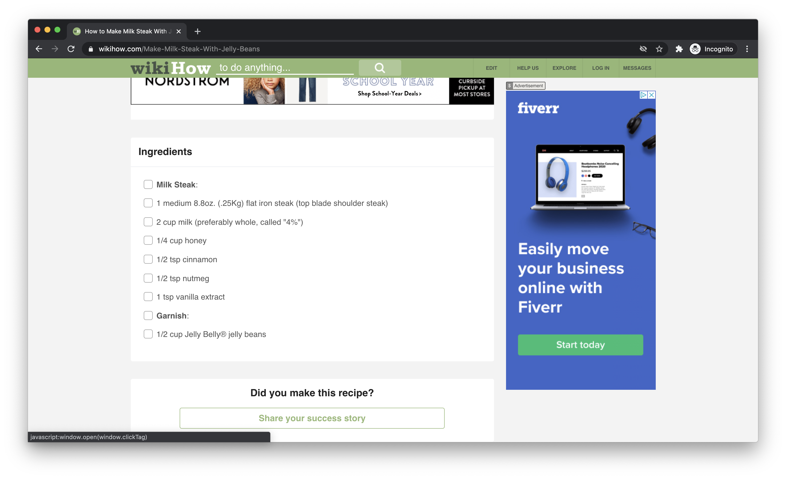

# Jupiter Take-Home Challenge

We're so excited that you're interested in [working with us](https://starship.jupiter.co/jupiter-stack/) at Jupiter! This project deals with one of our newly-launched features, [Recipes](https://app.jupiter.co/browse?c=Recipe%20Inspiration).

## Getting Started

Clone or fork this repository: `git clone git@github.com:Jupiter-Inc/take-home-challenge`.

## Goal

Create a Chrome extension that allows a user to create recipes from products in the Jupiter catalog from anywhere online.

A recipe will at the very least contain a recipe name, a list of products for the recipe, and corresponding quantity for each product for use in the recipe.

### Example

Suppose a Jupiter customer is looking for recipes on the internet, and decides that they want to save [the following recipe](https://www.wikihow.com/Make-Milk-Steak-With-Jelly-Beans) and add it to their Jupiter cart:

The Chrome extension should allow users to search the Jupiter catalog for "steak", "milk", and "honey,"; should allow users to choose products corresponding to those queries; and should allow the user to save the products they chose to a backend as a "recipe."

## Requirements

### Backend API

You'll want to create a backend API that at the very least can:

- Access/search for products from the Jupiter catalog.
- Create recipes from a list of products and quantities and a name.
- List recipes created by a given user.
- Handle user authentication in some way.

Use Jupiter's GraphQL API at https://graphql.jupiter.co to search for products. Other than that, all recipe and user data should be stored/handled by your backend.

### Extension

Given the backend API you create, you should create a user-friendly Chrome extension that can:

- Allows users to authenticate with your backend.
- Allows users to set a name for their recipe.
- Allows users to search for a product in the Jupiter catalog that matches what's called for in the recipe they want to create.
- Allows users to set the quantity on that product.
- Allows users to create a recipe and view the recipe they've created.

Feel free to use React or TypeScript in your Chrome extension (don't limit yourself to vanilla JS).

## Bonuses

- Allow users to automatically share the recipe they created to Pinterest, Facebook, Twitter, etc.
- Allow users to browse recipes that have been created by others.
- Allow users to update or delete recipes.
- Actually put the backend online via AWS, Heroku, GCP
- Think of your own, if you have extra time!

## Style Guide

- Jupiter red theme color is `rgb(255, 92, 92)`.
- We like clean, well-documented/commented code.
- We also like organized code that follows best software engineering practices: encapsulation, separation of concerns, etc.
- If you're familiar with our stack (Kotlin/gRPC/GraphQL/TypeScript/React), we'd love to see you build something with the technologies we already use

## Time

This project should take between 5 and 10 hours. If it's been longer than that, stop and commit what you have.

## Submission

Send us a link to your completed project on GitHub.

## Questions

If you have any questions, send an email to nate@jupiter.co.

## For Jupiter eyes only

Run `./publish.sh` to publish a new version of the take-home challenge to the [public repository](https://github.com/Jupiter-Inc/take-home-challenge).
